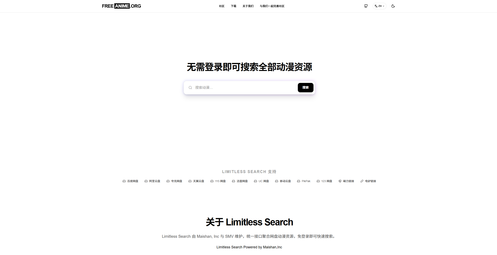
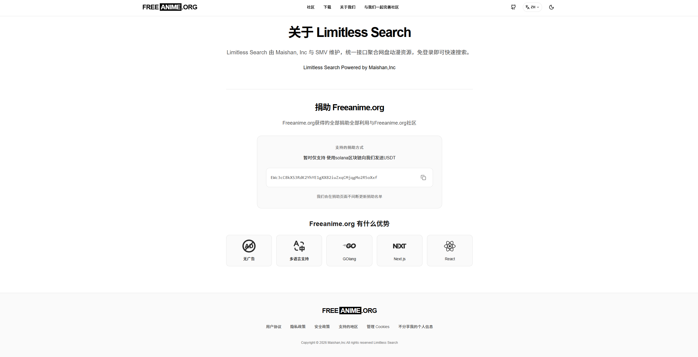
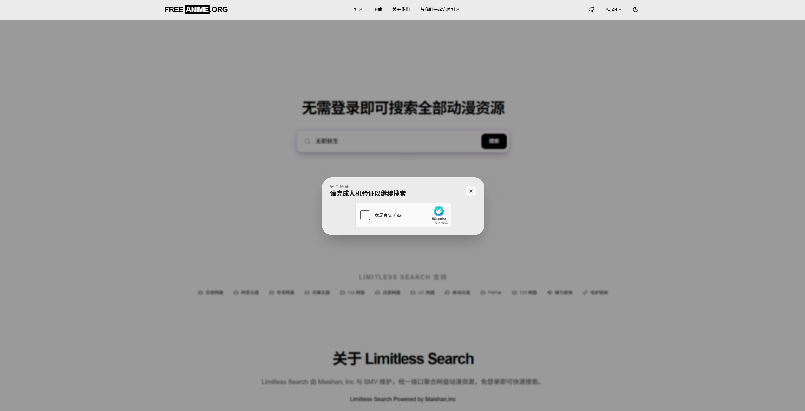
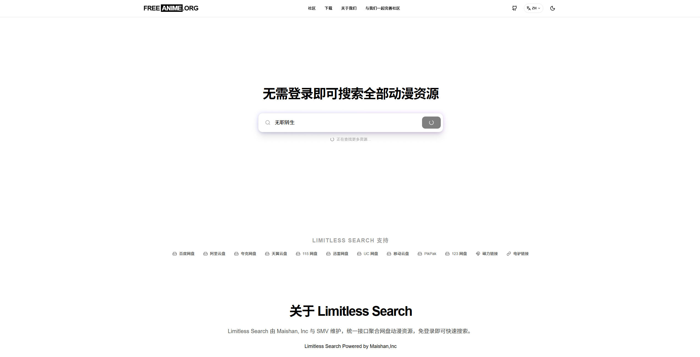
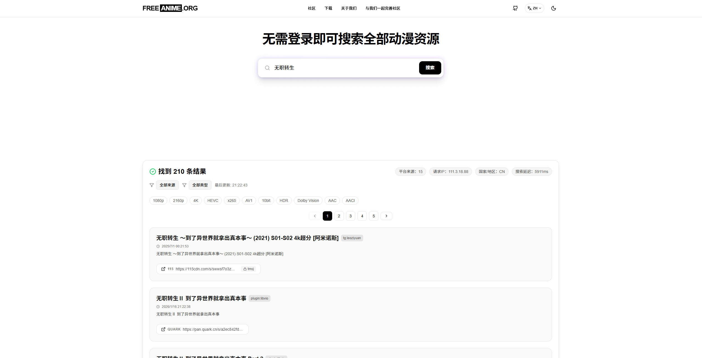

# Limitless Search

**简体中文** | [繁體中文](README_zh-TW.md) | [English](README_en.md) | [日本語](README_ja.md) | [Русский](README_ru.md) | [Français](README_fr.md)

Limitless Search 是一个高性能的开源网盘资源搜索工具，由Freeanime.org与Maishan Inc开发。

## 🌐 在线访问

**在线体验地址：** [https://search.freeanime.org](https://search.freeanime.org)  新版本测试地址：[https://search-bate.freeanime.org](https://search-bate.freeanime.org)

> 由 [Freeanime.org](https://freeanime.org) 赞助 Maishan Inc. 与 Freeanime.org组织 拥有 limitless-search-web 前端页面的全部版权，未经许可禁止商用。

## 📸 界面预览

<table>
  <tr>
    <td></td>
    <td></td>
  </tr>
  <tr>
    <td></td>
    <td></td>
  </tr>
  <tr>
    <td colspan="2" align="center"></td>
  </tr>
</table>

## 🌍 多语言支持

以下地区的语言实现 **100% 翻译**：

| 国家/地区 | 语言 | 文档 |
|-----------|------|------|
| 🇨🇳 中国 | 简体中文 | [README.md](README.md) |
| 🇹🇼 中国台湾 | 繁體中文 | [README_zh-TW.md](README_zh-TW.md) |
| 🇭🇰 中国香港 | 繁體中文 | [README_zh-TW.md](README_zh-TW.md) |
| 🇺🇸 美国 | English | [README_en.md](README_en.md) |
| 🇯🇵 日本 | 日本語 | [README_ja.md](README_ja.md) |
| 🇷🇺 俄罗斯 | Русский | [README_ru.md](README_ru.md) |
| 🇫🇷 法国 | Français | [README_fr.md](README_fr.md) |

> 需要更多语言？请提交 [Issues](https://github.com/maishaninc/limitless-search/issues)

## 📋 最近更新

**2026-01-25**
- 🗑️ 删除插件 javdb
- 🎨 更新了网站主页排版
- 🔍 优化了搜索功能
- 🌐 添加谷歌云盘搜索支持

## 🚀 快速部署

### 使用 Docker Compose（推荐）

1. 克隆项目文件

```bash
# HTTPS
git clone https://github.com/maishaninc/limitless-search.git

# SSH
git clone git@github.com:maishaninc/limitless-search.git

# GitHub CLI
gh repo clone maishaninc/limitless-search
```

2. 进入项目目录：
```bash
cd limitless-search
```

3. 启动服务：
```bash
docker-compose up -d
```

4. 访问服务：
- Web 界面：http://localhost:3200
- 后端 API：http://localhost:8888 [默认
### 查看日志

```bash
docker-compose logs -f
```

### 停止服务

```bash
docker-compose down
```

## 🔐 人机验证配置

Web 前端支持人机验证功能，可以防止恶意爬虫和滥用。配置文件位于 `web/limitless_search_web/.env`。

### 支持的验证服务

| 服务提供商 | 说明 |
|-----------|------|
| `turnstile` | Cloudflare Turnstile（推荐） |
| `hcaptcha` | hCaptcha （推荐） |
| `none` | 不启用验证（默认） |

### 配置方法

编辑 `web/limitless_search_web/.env` 文件：

```env
# 后端 API 地址
NEXT_PUBLIC_API_BASE=http://backend:8888

# --- 人机验证配置 ---
# 选择验证服务提供商: "turnstile" | "hcaptcha" | "none" 
NEXT_PUBLIC_CAPTCHA_PROVIDER=none

# [Cloudflare Turnstile 配置]
NEXT_PUBLIC_TURNSTILE_SITE_KEY=your-site-key
TURNSTILE_SECRET_KEY=your-secret-key

# [hCaptcha 配置]
NEXT_PUBLIC_HCAPTCHA_SITE_KEY=your-site-key
HCAPTCHA_SECRET_KEY=your-secret-key
```

### Cloudflare Turnstile 配置步骤

1. 访问 [Cloudflare Dashboard](https://dash.cloudflare.com/)
2. 进入 **Turnstile** 页面
3. 点击 **Add Site** 创建新站点
4. 获取 **Site Key** 和 **Secret Key**
5. 在 `.env` 文件中配置：
   ```env
   NEXT_PUBLIC_CAPTCHA_PROVIDER=turnstile
   NEXT_PUBLIC_TURNSTILE_SITE_KEY=0x4AAAAAAA...
   TURNSTILE_SECRET_KEY=0x4AAAAAAA...
   ```

### hCaptcha 配置步骤

1. 访问 [hCaptcha Dashboard](https://dashboard.hcaptcha.com/)
2. 注册并创建新站点
3. 获取 **Site Key** 和 **Secret Key**
4. 在 `.env` 文件中配置：
   ```env
   NEXT_PUBLIC_CAPTCHA_PROVIDER=hcaptcha
   NEXT_PUBLIC_HCAPTCHA_SITE_KEY=your-site-key
   HCAPTCHA_SECRET_KEY=your-secret-key
   ```

## 🆕 版本更新

### Docker 部署更新（推荐）

在服务器上更新到最新版本并重新构建：

```bash
cd limitless-search

git pull

docker-compose down

docker-compose build --no-cache

docker-compose up -d
```

### 本地开发更新

```bash
cd limitless-search

git pull
```

> 如果你修改过本地代码，请先备份或使用 git stash 保存改动。

## 🤖 AI 推荐配置

前端支持 AI 推荐查询功能，可根据搜索结果数量给出原版名称建议。配置文件位于 `web/limitless_search_web/.env`。

```env
# --- AI 推荐配置 ---
# 是否启用 AI 推荐（默认 true）
NEXT_PUBLIC_AI_SUGGEST_ENABLED=true

# 触发阈值（结果条数 <= 阈值时触发）
NEXT_PUBLIC_AI_SUGGEST_THRESHOLD=50

# 是否强制要求先通过人机验证
NEXT_PUBLIC_AI_SUGGEST_REQUIRE_CAPTCHA=false
```

> 说明：若未配置或设置为 `false`，AI 推荐将不显示。

## ⚙️ 配置说明

### 后端环境变量

在 `docker-compose.yml` 中配置后端服务的环境变量：

| 环境变量 | 描述 | 默认值 |
|----------|------|--------|
| `PORT` | 后端监听端口 | `8888` |
| `CHANNELS` | TG 频道列表（逗号分隔） | 见下方说明 |
| `ENABLED_PLUGINS` | 启用的插件列表（逗号分隔） | 见下方说明 |
| `CACHE_ENABLED` | 是否启用缓存 | `true` |
| `CACHE_PATH` | 缓存路径 | `/app/cache` |
| `CACHE_MAX_SIZE` | 最大缓存大小(MB) | `100` |
| `CACHE_TTL` | 缓存有效期(分钟) | `60` |
| `ASYNC_PLUGIN_ENABLED` | 是否启用异步插件 | `true` |
| `ASYNC_RESPONSE_TIMEOUT` | 异步响应超时(秒) | `4` |
| `ASYNC_MAX_BACKGROUND_WORKERS` | 最大后台工作者数量 | `20` |
| `ASYNC_MAX_BACKGROUND_TASKS` | 最大后台任务数量 | `100` |
| `ASYNC_CACHE_TTL_HOURS` | 异步缓存有效期(小时) | `1` |
| `PROXY` | 代理设置（可选） | 无 |

### TG 频道配置 (CHANNELS)

`CHANNELS` 环境变量用于配置要搜索的 Telegram 频道列表，多个频道用逗号分隔。

**当前配置的频道列表：**

```
tgsearchers4,Aliyun_4K_Movies,bdbdndn11,yunpanx,bsbdbfjfjff,yp123pan,sbsbsnsqq,
yunpanxunlei,tianyifc,BaiduCloudDisk,txtyzy,peccxinpd,gotopan,PanjClub,kkxlzy,
baicaoZY,MCPH01,MCPH02,MCPH03,bdwpzhpd,ysxb48,jdjdn1111,yggpan,MCPH086,zaihuayun,
Q66Share,ucwpzy,shareAliyun,alyp_1,dianyingshare,Quark_Movies,XiangxiuNBB,
ydypzyfx,ucquark,xx123pan,yingshifenxiang123,zyfb123,tyypzhpd,tianyirigeng,
cloudtianyi,hdhhd21,Lsp115,oneonefivewpfx,qixingzhenren,taoxgzy,Channel_Shares_115,
tyysypzypd,vip115hot,wp123zy,yunpan139,yunpan189,yunpanuc,yydf_hzl,leoziyuan,
pikpakpan,Q_dongman,yoyokuakeduanju,TG654TG,WFYSFX02,QukanMovie,yeqingjie_GJG666,
movielover8888_film3,Baidu_netdisk,D_wusun,FLMdongtianfudi,KaiPanshare,QQZYDAPP,
rjyxfx,PikPak_Share_Channel,btzhi,newproductsourcing,cctv1211,duan_ju,QuarkFree,
yunpanNB,kkdj001,xxzlzn,pxyunpanxunlei,jxwpzy,kuakedongman,liangxingzhinan,
xiangnikanj,solidsexydoll,guoman4K,zdqxm,kduanju,cilidianying,CBduanju,
SharePanFilms,dzsgx,BooksRealm,Oscar_4Kmovies,douerpan,baidu_yppan,Q_jilupian,
Netdisk_Movies,yunpanquark,ammmziyuan,ciliziyuanku,cili8888,jzmm_123pan
```

### 插件配置 (ENABLED_PLUGINS)

`ENABLED_PLUGINS` 环境变量用于配置要启用的搜索插件，多个插件用逗号分隔。

**当前配置的插件列表：**

```
labi,zhizhen,shandian,duoduo,muou,wanou,hunhepan,jikepan,panwiki,pansearch,
panta,qupansou,hdr4k,pan666,susu,thepiratebay,xuexizhinan,panyq,ouge,huban,
cyg,erxiao,miaoso,fox4k,pianku,clmao,wuji,cldi,xiaozhang,libvio,leijing,
xb6v,xys,ddys,hdmoli,yuhuage,u3c3,javdb,clxiong,jutoushe,sdso,xiaoji,xdyh,
haisou,bixin,djgou,nyaa,xinjuc,aikanzy,qupanshe,xdpan,discourse,yunsou,qqpd,
ahhhhfs,nsgame,gying,quark4k,quarksoo,sousou,ash
```

**插件说明：**
- 如果不设置 `ENABLED_PLUGINS`，则不启用任何插件
- 设置为空字符串也表示不启用任何插件
- 只有在列表中的插件才会被启用

### 认证配置（可选）

如需启用 API 认证，取消注释以下环境变量：

```yaml
environment:
  - AUTH_ENABLED=true
  - AUTH_USERS=admin:admin123,user:pass456
  - AUTH_TOKEN_EXPIRY=24
  - AUTH_JWT_SECRET=your-secret-key-here
```

| 环境变量 | 描述 | 默认值 |
|----------|------|--------|
| `AUTH_ENABLED` | 是否启用认证 | `false` |
| `AUTH_USERS` | 用户账号配置（格式：user1:pass1,user2:pass2） | 无 |
| `AUTH_TOKEN_EXPIRY` | Token 有效期（小时） | `24` |
| `AUTH_JWT_SECRET` | JWT 签名密钥 | 自动生成 |

### 代理配置（可选）

如需使用代理访问 Telegram，取消注释以下环境变量：

```yaml
environment:
  - PROXY=socks5://proxy:7897
```

## 📁 项目结构

```
.
├── docker-compose.yml          # Docker Compose 配置文件
├── README.md                   # 项目说明文档
├── backend/
│   └── limitless_search/       # 后端服务
│       ├── Dockerfile
│       ├── main.go
│       ├── api/                # API 处理
│       ├── config/             # 配置管理
│       ├── model/              # 数据模型
│       ├── plugin/             # 搜索插件
│       └── docs/               # 文档
└── web/
    └── limitless_search_web/   # Web 前端
        ├── Dockerfile
        ├── .env                # 环境变量配置
        └── src/                # 源代码
```

## 🌐 支持的网盘类型

- 百度网盘 (`baidu`)
- 阿里云盘 (`aliyun`)
- 夸克网盘 (`quark`)
- 天翼云盘 (`tianyi`)
- UC网盘 (`uc`)
- 移动云盘 (`mobile`)
- 115网盘 (`115`)
- PikPak (`pikpak`)
- 迅雷网盘 (`xunlei`)
- 123网盘 (`123`)
- 谷歌云盘 (`google`)
- 磁力链接 (`magnet`)
- 电驴链接 (`ed2k`)

## 📖 API 文档

### 搜索接口

**POST /api/search**

```bash
curl -X POST http://localhost:8888/api/search \
  -H "Content-Type: application/json" \
  -d '{"kw": "xxxxx"}'
```

**GET /api/search**

```bash
curl "http://localhost:8888/api/search?kw=xxxxx"
```

### 健康检查

```bash
curl http://localhost:8888/api/health
```

## 🔧 常见问题

### 1. 如何添加新的 TG 频道？

修改 `docker-compose.yml` 中的 `CHANNELS` 环境变量，添加新的频道名称（用逗号分隔），然后重启服务：

```bash
docker-compose down
docker-compose up -d
```

### 2. 如何启用/禁用插件？

修改 `docker-compose.yml` 中的 `ENABLED_PLUGINS` 环境变量，然后重启服务。

### 3. 搜索结果为空？

- 检查网络连接是否正常
- 如果在中国大陆，可能需要配置代理访问 Telegram
- 检查 TG 频道名称是否正确

### 4. 如何配置代理？

在 `docker-compose.yml` 中取消注释 `PROXY` 环境变量并设置代理地址：

```yaml
environment:
  - PROXY=socks5://your-proxy:port
```

## 📄 许可证

[](https://creativecommons.org/licenses/by-nc/4.0/)

本项目采用 [CC BY-NC 4.0 (署名-非商业性使用 4.0 国际)](https://creativecommons.org/licenses/by-nc/4.0/deed.zh-hans) 许可证。

您可以自由地：
- **分享** — 在任何媒介以任何形式复制、发行本作品
- **演绎** — 修改、转换或以本作品为基础进行创作

惟须遵守下列条件：
- **署名** — 您必须给出适当的署名，提供指向本许可证的链接，同时标明是否（对原始作品）作了修改
- **非商业性使用** — 您不得将本作品用于商业目的

## 🔗 相关链接

- [后端详细文档](backend/limitless_search/docs/README.md)
- [插件开发指南](backend/limitless_search/docs/插件开发指南.md)
- [系统设计文档](backend/limitless_search/docs/系统开发设计文档.md)

---

后端 基于 [PanSou](https://github.com/fish2018/pansou) 项目开发 limitless-search-backend 部分。以MIT许可证开源。
前端 limitless-search-web Maishan Inc. 与 Freeanime.org组织 拥有 limitless-search-web 前端页面的全部版权，未经许可禁止商用。
