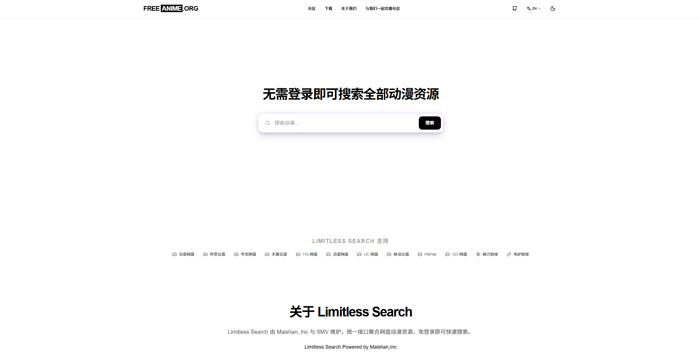
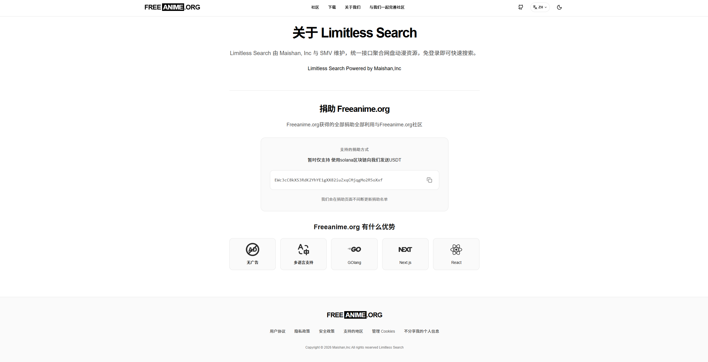
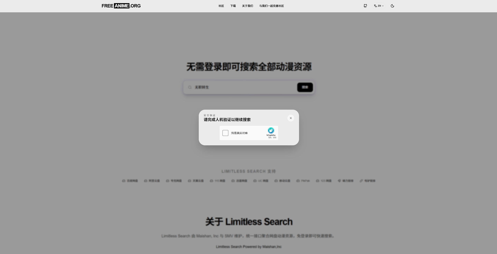
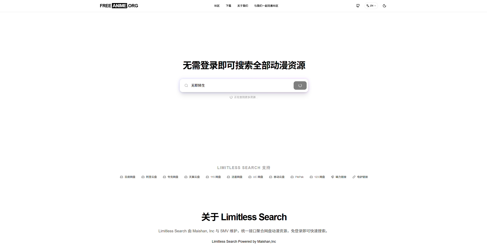
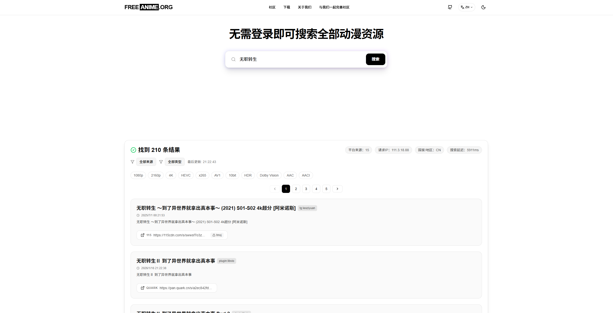

# Limitless Search

[简体中文](README.md) | [繁體中文](README_zh-TW.md) | [English](README_en.md) | [日本語](README_ja.md) | **Русский** | [Français](README_fr.md)

Limitless Search — это высокопроизводительный инструмент поиска ресурсов облачного хранилища с открытым исходным кодом, разработанный Freeanime.org и Maishan Inc.

## 🌐 Онлайн-доступ

**Демо-сайт:** [https://search.freeanime.org](https://search.freeanime.org)

**Тестовый URL новой версии:** [https://search-bate.freeanime.org](https://search-bate.freeanime.org)

**Новые функции в тестовой версии:**
- Добавлен вход в AI-рейтинг аниме и отдельная страница (год / месяц / день, с разворачиванием списка)
- При клике по пункту рейтинга открывается главная страница с предзаполненным запросом (без автопоиска)
- Локализованный запрос по текущему языку сайта (для китайского интерфейса приоритет у китайского названия)
- Для генерации рейтинга добавлены ретраи, логи ошибок и fallback-страница
- Добавлены настраиваемые SEO-страницы рейтингов и расширение sitemap

> Спонсор [Freeanime.org](https://freeanime.org). Maishan Inc. и организация Freeanime.org владеют всеми авторскими правами на фронтенд limitless-search-web. Коммерческое использование без разрешения запрещено.

## 📸 Предварительный просмотр интерфейса

<table>
  <tr>
    <td></td>
    <td></td>
  </tr>
  <tr>
    <td></td>
    <td></td>
  </tr>
  <tr>
    <td colspan="2" align="center"></td>
  </tr>
</table>

## 🆕 Обновление версии (2026-03-08)

- Переменные окружения frontend теперь настраиваются в сервисе `web` корневого `docker-compose.yml`
- Frontend больше не зависит по умолчанию от `web/limitless_search_web/.env`
- Адрес backend теперь встраивается в frontend на этапе сборки через `NEXT_PUBLIC_API_BASE`
- Исправлены проблемы рендеринга hCaptcha на frontend и серверной проверки

## 🌍 Многоязычная поддержка

**100% перевод** доступен для следующих регионов:

| Страна/Регион | Язык | Документация |
|---------------|------|--------------|
| 🇨🇳 Китай | 简体中文 | [README.md](README.md) |
| 🇹🇼 Тайвань, Китай | 繁體中文 | [README_zh-TW.md](README_zh-TW.md) |
| 🇭🇰 Гонконг, Китай | 繁體中文 | [README_zh-TW.md](README_zh-TW.md) |
| 🇺🇸 США | English | [README_en.md](README_en.md) |
| 🇯🇵 Япония | 日本語 | [README_ja.md](README_ja.md) |
| 🇷🇺 Россия | Русский | [README_ru.md](README_ru.md) |
| 🇫🇷 Франция | Français | [README_fr.md](README_fr.md) |

> Нужны другие языки? Создайте [Issue](https://github.com/maishaninc/limitless-search/issues)

## 🚀 Быстрое развёртывание

### Использование Docker Compose (рекомендуется)

1. Клонируйте проект

```bash
# HTTPS
git clone https://github.com/maishaninc/limitless-search.git

# SSH
git clone git@github.com:maishaninc/limitless-search.git

# GitHub CLI
gh repo clone maishaninc/limitless-search
```

2. Перейдите в каталог проекта:
```bash
cd limitless-search
```

3. Запустите сервисы:
```bash
docker-compose up -d
```

4. Доступ к сервисам:
- Веб-интерфейс: http://localhost:3200
- Backend API: по умолчанию доступен только во внутренней сети Docker по адресу `http://backend:8888` и не опубликован напрямую на хосте

### Просмотр логов

```bash
docker-compose logs -f
```

### Остановка сервисов

```bash
docker-compose down
```

## 🔧 Настройка окружения Frontend

Docker-развёртывание больше не использует `web/limitless_search_web/.env`. Параметры frontend теперь задаются в корневом `docker-compose.yml` в секциях `web.build.args` и `web.environment`.

### Настройка Docker-развёртывания

Изменяйте сервис `web:` напрямую в `docker-compose.yml`:

```yaml
web:
  build:
    context: ./web/limitless_search_web
    dockerfile: Dockerfile
    args:
      - NEXT_PUBLIC_API_BASE=http://backend:8888
      - NEXT_PUBLIC_CAPTCHA_PROVIDER=none
      - NEXT_PUBLIC_TURNSTILE_SITE_KEY=
      - NEXT_PUBLIC_HCAPTCHA_SITE_KEY=
      - NEXT_PUBLIC_AI_SUGGEST_ENABLED=true
      - NEXT_PUBLIC_AI_SUGGEST_THRESHOLD=50
      - NEXT_PUBLIC_AI_SUGGEST_REQUIRE_CAPTCHA=false
  environment:
    - TURNSTILE_SECRET_KEY=
    - HCAPTCHA_SECRET_KEY=
    - AI_SUGGEST_BASE_URL=
    - AI_SUGGEST_MODEL=
    - AI_SUGGEST_API_KEY=
    - AI_SUGGEST_PROMPT=
```

### Только для локальной разработки

Если вы запускаете frontend локально без Docker, скопируйте пример файла:

```bash
cp web/limitless_search_web/.env.example web/limitless_search_web/.env.local
```

### Справочник конфигурации

| Переменная | Описание | По умолчанию |
|------------|----------|--------------|
| `NEXT_PUBLIC_API_BASE` | URL backend API, встраиваемый на этапе сборки frontend | `http://backend:8888` |
| `NEXT_PUBLIC_CAPTCHA_PROVIDER` | Провайдер CAPTCHA-сервиса | `none` |
| `NEXT_PUBLIC_TURNSTILE_SITE_KEY` | Cloudflare Turnstile Site Key | Нет |
| `TURNSTILE_SECRET_KEY` | Cloudflare Turnstile Secret Key | Нет |
| `NEXT_PUBLIC_HCAPTCHA_SITE_KEY` | hCaptcha Site Key | Нет |
| `HCAPTCHA_SECRET_KEY` | hCaptcha Secret Key | Нет |
| `NEXT_PUBLIC_AI_SUGGEST_ENABLED` | Включить AI-рекомендации | `true` |
| `NEXT_PUBLIC_AI_SUGGEST_THRESHOLD` | Порог срабатывания AI | `50` |
| `NEXT_PUBLIC_AI_SUGGEST_REQUIRE_CAPTCHA` | Требовать CAPTCHA перед AI-подсказкой | `false` |
| `AI_SUGGEST_BASE_URL` | Конечная точка OpenAI API | Нет |
| `AI_SUGGEST_MODEL` | Имя модели OpenAI | Нет |
| `AI_SUGGEST_API_KEY` | API Key OpenAI | Нет |
| `AI_SUGGEST_PROMPT` | Пользовательский промпт | Встроенный промпт |

> **Примечание**: Для Docker-развёртывания не создавайте `web/limitless_search_web/.env`. Он нужен только при локальной разработке frontend, и тогда лучше использовать `web/limitless_search_web/.env.local`.

> **Дополнительно**: Текущий корневой `docker-compose.yml` публикует только порт `3200`. Порт `8888` backend доступен только контейнерам в сети `limitless-network`. Если нужен прямой доступ с хоста для отладки backend, добавьте mapping `ports` в сервис `backend` самостоятельно.

### Обновление Docker-развёртывания (рекомендуется)

Обновите до последней версии и пересоберите на сервере:

```bash
cd limitless-search

git pull

docker-compose down

docker-compose build --no-cache

docker-compose up -d
```

### Обновление локальной разработки

```bash
cd limitless-search

git pull
```

> Если вы изменили локальный код, сначала сделайте резервную копию или используйте git stash для сохранения изменений.

## ⚙️ Руководство по настройке

### Переменные окружения Backend

Настройте переменные окружения backend-сервиса в `docker-compose.yml`:

| Переменная | Описание | По умолчанию |
|------------|----------|--------------|
| `PORT` | Порт прослушивания backend | `8888` |
| `CHANNELS` | Список TG-каналов (через запятую) | См. ниже |
| `ENABLED_PLUGINS` | Список включённых плагинов (через запятую) | См. ниже |
| `CACHE_ENABLED` | Включить кэширование | `true` |
| `CACHE_PATH` | Путь к кэшу | `/app/cache` |
| `CACHE_MAX_SIZE` | Максимальный размер кэша (МБ) | `100` |
| `CACHE_TTL` | TTL кэша (минуты) | `60` |
| `ASYNC_PLUGIN_ENABLED` | Включить асинхронные плагины | `true` |
| `ASYNC_RESPONSE_TIMEOUT` | Таймаут асинхронного ответа (секунды) | `4` |
| `ASYNC_MAX_BACKGROUND_WORKERS` | Макс. фоновых воркеров | `20` |
| `ASYNC_MAX_BACKGROUND_TASKS` | Макс. фоновых задач | `100` |
| `ASYNC_CACHE_TTL_HOURS` | TTL асинхронного кэша (часы) | `1` |
| `PROXY` | Настройки прокси (опционально) | Нет |

### Настройка TG-каналов (CHANNELS)

Переменная окружения `CHANNELS` настраивает список Telegram-каналов для поиска, разделённых запятыми.

**Текущие настроенные каналы:**

```
tgsearchers4,Aliyun_4K_Movies,bdbdndn11,yunpanx,bsbdbfjfjff,yp123pan,sbsbsnsqq,
yunpanxunlei,tianyifc,BaiduCloudDisk,txtyzy,peccxinpd,gotopan,PanjClub,kkxlzy,
baicaoZY,MCPH01,MCPH02,MCPH03,bdwpzhpd,ysxb48,jdjdn1111,yggpan,MCPH086,zaihuayun,
Q66Share,ucwpzy,shareAliyun,alyp_1,dianyingshare,Quark_Movies,XiangxiuNBB,
ydypzyfx,ucquark,xx123pan,yingshifenxiang123,zyfb123,tyypzhpd,tianyirigeng,
cloudtianyi,hdhhd21,Lsp115,oneonefivewpfx,qixingzhenren,taoxgzy,Channel_Shares_115,
tyysypzypd,vip115hot,wp123zy,yunpan139,yunpan189,yunpanuc,yydf_hzl,leoziyuan,
pikpakpan,Q_dongman,yoyokuakeduanju,TG654TG,WFYSFX02,QukanMovie,yeqingjie_GJG666,
movielover8888_film3,Baidu_netdisk,D_wusun,FLMdongtianfudi,KaiPanshare,QQZYDAPP,
rjyxfx,PikPak_Share_Channel,btzhi,newproductsourcing,cctv1211,duan_ju,QuarkFree,
yunpanNB,kkdj001,xxzlzn,pxyunpanxunlei,jxwpzy,kuakedongman,liangxingzhinan,
xiangnikanj,solidsexydoll,guoman4K,zdqxm,kduanju,cilidianying,CBduanju,
SharePanFilms,dzsgx,BooksRealm,Oscar_4Kmovies,douerpan,baidu_yppan,Q_jilupian,
Netdisk_Movies,yunpanquark,ammmziyuan,ciliziyuanku,cili8888,jzmm_123pan
```

### Настройка плагинов (ENABLED_PLUGINS)

Переменная окружения `ENABLED_PLUGINS` настраивает плагины поиска для включения, разделённые запятыми.

**Текущие настроенные плагины:**

```
labi,zhizhen,shandian,duoduo,muou,wanou,hunhepan,jikepan,panwiki,pansearch,
panta,qupansou,hdr4k,pan666,susu,thepiratebay,xuexizhinan,panyq,ouge,huban,
cyg,erxiao,miaoso,fox4k,pianku,clmao,wuji,cldi,xiaozhang,libvio,leijing,
xb6v,xys,ddys,hdmoli,yuhuage,u3c3,clxiong,jutoushe,sdso,xiaoji,xdyh,
haisou,bixin,djgou,nyaa,xinjuc,aikanzy,qupanshe,xdpan,discourse,yunsou,qqpd,
ahhhhfs,nsgame,gying,quark4k,quarksoo,sousou,ash
```

**Примечания по плагинам:**
- Если `ENABLED_PLUGINS` не установлен, плагины не будут включены
- Установка пустой строки также означает отсутствие включённых плагинов
- Будут включены только плагины из списка

### Настройка аутентификации (опционально)

Чтобы включить API-аутентификацию, раскомментируйте следующие переменные окружения:

```yaml
environment:
  - AUTH_ENABLED=true
  - AUTH_USERS=admin:admin123,user:pass456
  - AUTH_TOKEN_EXPIRY=24
  - AUTH_JWT_SECRET=your-secret-key-here
```

| Переменная | Описание | По умолчанию |
|------------|----------|--------------|
| `AUTH_ENABLED` | Включить аутентификацию | `false` |
| `AUTH_USERS` | Учётные записи пользователей (формат: user1:pass1,user2:pass2) | Нет |
| `AUTH_TOKEN_EXPIRY` | Срок действия токена (часы) | `24` |
| `AUTH_JWT_SECRET` | Ключ подписи JWT | Автогенерация |

### Настройка прокси (опционально)

Чтобы использовать прокси для доступа к Telegram, раскомментируйте следующую переменную окружения:

```yaml
environment:
  - PROXY=socks5://proxy:7897
```

## 📁 Структура проекта

```
.
├── docker-compose.yml          # Конфигурация Docker Compose
├── README.md                   # Документация проекта
├── backend/
│   └── limitless_search/       # Backend-сервис
│       ├── Dockerfile
│       ├── main.go
│       ├── api/                # API-обработчики
│       ├── config/             # Управление конфигурацией
│       ├── model/              # Модели данных
│       ├── plugin/             # Плагины поиска
│       └── docs/               # Документация
└── web/
    └── limitless_search_web/   # Веб-фронтенд
        ├── Dockerfile
        ├── .env.example        # Пример переменных для локальной разработки
        └── src/                # Исходный код
```

## 🌐 Поддерживаемые типы облачных хранилищ

- Baidu Netdisk (`baidu`)
- Aliyun Drive (`aliyun`)
- Quark Drive (`quark`)
- Tianyi Cloud (`tianyi`)
- UC Drive (`uc`)
- Mobile Cloud (`mobile`)
- 115 Drive (`115`)
- PikPak (`pikpak`)
- Xunlei Drive (`xunlei`)
- 123 Drive (`123`)
- Google Диск (`google`)
- Magnet-ссылки (`magnet`)
- ED2K-ссылки (`ed2k`)

## 📖 Документация API

### Эндпоинт поиска

**POST /api/search**

```bash
curl -X POST http://localhost:8888/api/search \
  -H "Content-Type: application/json" \
  -d '{"kw": "xxxxx"}'
```

**GET /api/search**

```bash
curl "http://localhost:8888/api/search?kw=xxxxx"
```

### Проверка работоспособности

```bash
curl http://localhost:8888/api/health
```

## 🔧 Часто задаваемые вопросы

### 1. Как добавить новые TG-каналы?

Измените переменную окружения `CHANNELS` в `docker-compose.yml`, добавьте новые названия каналов (через запятую), затем перезапустите сервис:

```bash
docker-compose down
docker-compose up -d
```

### 2. Как включить/отключить плагины?

Измените переменную окружения `ENABLED_PLUGINS` в `docker-compose.yml`, затем перезапустите сервис.

### 3. Пустые результаты поиска?

- Проверьте, нормально ли работает сетевое подключение
- Если вы в материковом Китае, возможно, потребуется настроить прокси для доступа к Telegram
- Проверьте правильность названий TG-каналов

### 4. Как настроить прокси?

Раскомментируйте переменную окружения `PROXY` в `docker-compose.yml` и установите адрес прокси:

```yaml
environment:
  - PROXY=socks5://your-proxy:port
```

## 📄 Лицензия

[](https://creativecommons.org/licenses/by-nc/4.0/)

Этот проект лицензирован под [CC BY-NC 4.0 (Атрибуция-Некоммерческое использование 4.0 Международная)](https://creativecommons.org/licenses/by-nc/4.0/deed.ru).

Вы можете свободно:
- **Делиться** — копировать и распространять материал на любом носителе и в любом формате
- **Адаптировать** — ремиксовать, преобразовывать и создавать на основе материала

При соблюдении следующих условий:
- **Атрибуция** — Вы должны указать авторство, предоставить ссылку на лицензию и указать, были ли внесены изменения
- **Некоммерческое использование** — Вы не можете использовать материал в коммерческих целях

## 🔗 Связанные ссылки

- [Документация Backend](backend/limitless_search/docs/README.md)
- [Руководство по разработке плагинов](backend/limitless_search/docs/插件开发指南.md)
- [Документ проектирования системы](backend/limitless_search/docs/系统开发设计文档.md)

---

Backend основан на проекте [PanSou](https://github.com/fish2018/pansou) для части limitless-search-backend. Открытый исходный код под лицензией MIT.
Фронтенд limitless-search-web: Maishan Inc. и организация Freeanime.org владеют всеми авторскими правами на фронтенд limitless-search-web. Коммерческое использование без разрешения запрещено.
